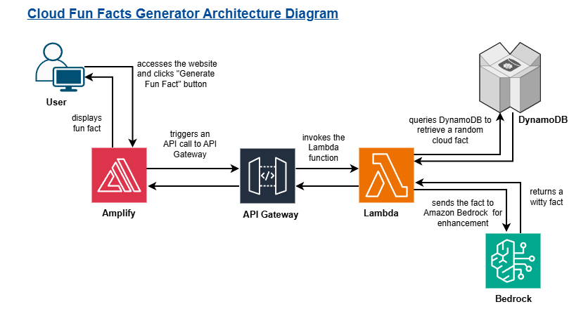
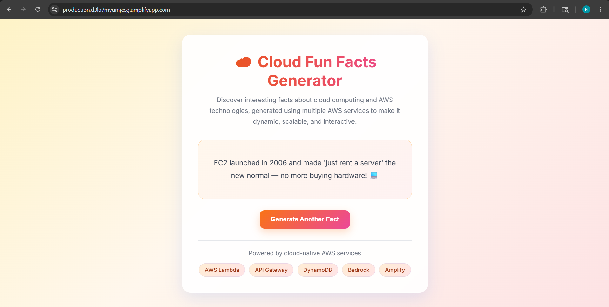

#  Cloud Fun Facts Generator

A full-stack serverless application that delivers random, AI-enhanced cloud computing facts at the click of a button. Built entirely on AWS using a modern serverless-first architecture.

---

##  What It Does

With a single click, the app fetches a random cloud computing fact from a DynamoDB database, passes it through Amazon Bedrock's Claude AI to make it witty and engaging, and displays it on a clean, responsive frontend - all without managing a single server.

---

##  Architecture

## Screenshots

### Live Website

---

##  AWS Services Used

| Service | Purpose |
|---|---|
| **AWS Lambda** | Serverless backend that fetches and processes cloud facts |
| **Amazon API Gateway** | Exposes Lambda as a public HTTP API endpoint |
| **Amazon DynamoDB** | NoSQL database that stores all cloud fun facts |
| **Amazon Bedrock** | Generative AI (Claude 3 Sonnet) to rephrase facts in a witty style |
| **AWS Amplify** | Hosts and serves the static frontend with HTTPS and CDN |
| **AWS IAM** | Manages permissions securely for Lambda to access DynamoDB and Bedrock |

---

##  Project Stages

### Stage 1 - Serverless Backend (Lambda + API Gateway)
- Created an AWS Lambda function (`CloudFunFacts`) with Python 3.13
- Hardcoded a list of cloud facts returned as JSON responses
- Created an HTTP API in API Gateway with route `GET /funfact`
- Integrated API Gateway with Lambda and tested the live endpoint

### Stage 2 - Database Integration (DynamoDB)
- Created a DynamoDB table `CloudFacts` with `FactID` as the partition key
- Inserted 15 cloud fun facts as items in the table
- Updated Lambda to dynamically fetch and return a random fact using `table.scan()`
- Attached `AmazonDynamoDBReadOnlyAccess` policy to the Lambda IAM role

### Stage 3 - GenAI Integration (Amazon Bedrock)
- Requested and received access to Anthropic Claude 3 Sonnet via Amazon Bedrock
- Updated Lambda to call Bedrock's `invoke_model` API after fetching a fact from DynamoDB
- Prompted Claude to rewrite each fact in a fun and engaging style (1–2 sentences)
- Attached `AmazonBedrockFullAccess` policy to the Lambda IAM role
- Increased Lambda timeout to 30 seconds to handle Bedrock response time

### Stage 4 - Frontend Deployment (AWS Amplify)
- Built a responsive `index.html` frontend with loading states and error handling
- Configured CORS on API Gateway to allow requests from the Amplify domain
- Deployed the frontend to AWS Amplify using ZIP upload
- Tested the complete end-to-end flow via the Amplify live URL

---

##  Cost Analysis

This project is designed to stay well within AWS Free Tier limits for personal and learning use.

| Service | Free Tier | Estimated Usage | Estimated Cost |
|---|---|---|---|
| **AWS Lambda** | 1M requests/month free | ~100–500 test calls | $0.00 |
| **API Gateway** | 1M HTTP API calls/month free | ~100–500 calls | $0.00 |
| **DynamoDB** | 25 GB storage + 25 WCU/RCU free | 12 items, minimal reads | $0.00 |
| **AWS Amplify** | 1000 build minutes + 5 GB hosting free | 1 static HTML deploy | $0.00 |
| **Amazon Bedrock** | Pay per use (no free tier) | ~100 inference calls | ~$0.01–$0.03 |
| **IAM** | Always free | Role + 2 policies | $0.00 |

> **Total Estimated Cost: ~$0.00 – $0.03**
>
> Bedrock is the only paid service - Claude 3 Sonnet charges approximately $0.003 per 1K input tokens and $0.015 per 1K output tokens. For short fact rewrites, each call costs a fraction of a cent.

---

##  What I Built

- Deployed an AWS Lambda function to serve random cloud fun facts
- Integrated API Gateway to expose Lambda as a HTTP API endpoint
- Stored facts in DynamoDB for a scalable, code-free data layer
- Configured IAM roles following the least privilege principle
- Integrated Amazon Bedrock with Claude AI to make facts witty and engaging
- Deployed a responsive frontend on AWS Amplify with HTTPS and global CDN

---

##  Key Learnings

- How serverless architecture works end-to-end on AWS
- How API Gateway routes HTTP requests to Lambda
- How DynamoDB separates data from logic for flexible backends
- How to securely grant AWS services access to each other using IAM
- How to invoke foundation models via Amazon Bedrock from Lambda
- How to host and deploy static frontends using AWS Amplify

---

##  Author

**Harshal Yadav**

---

